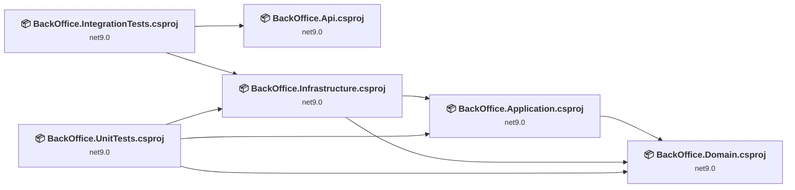
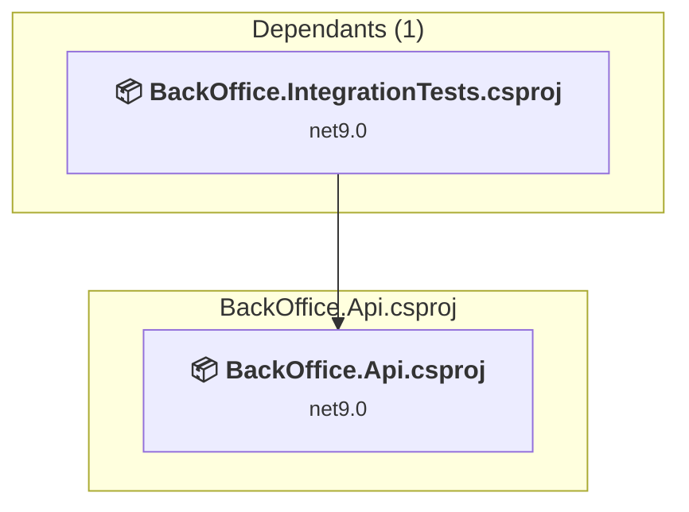
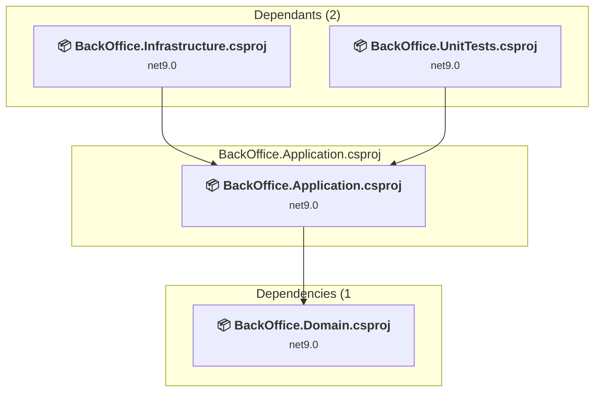
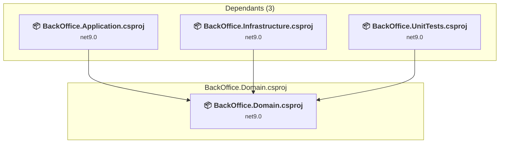
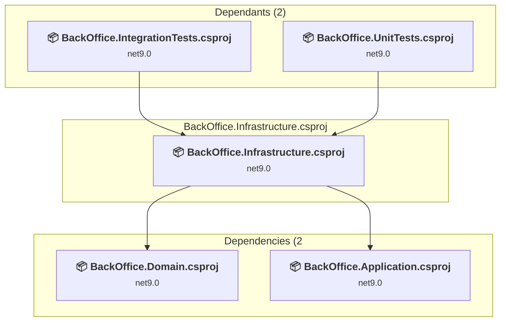
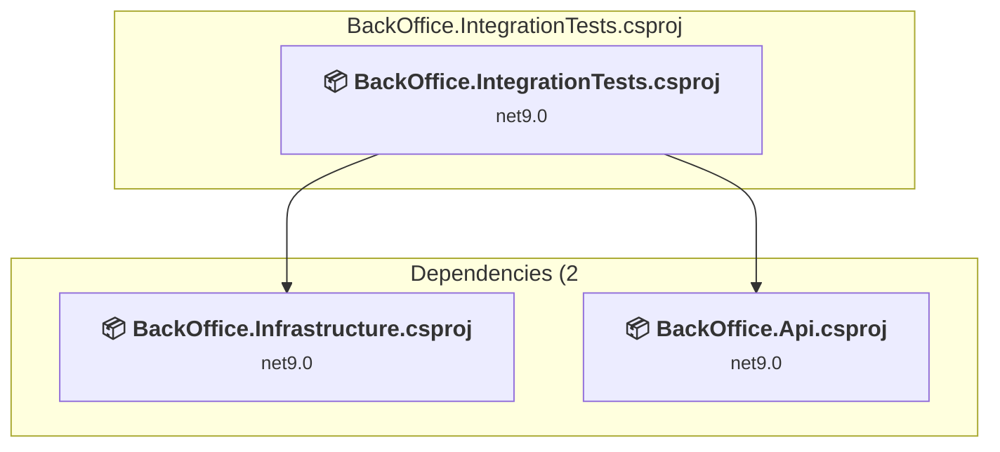
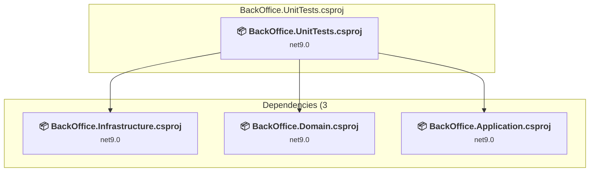

# Projects and dependencies analysis

This document provides a comprehensive overview of the projects and their dependencies in the context of upgrading to .NETCoreApp,Version=v10.0.

## Table of Contents

- [Executive Summary](#executive-Summary)
  - [Highlevel Metrics](#highlevel-metrics)
  - [Projects Compatibility](#projects-compatibility)
  - [Package Compatibility](#package-compatibility)
  - [API Compatibility](#api-compatibility)
- [Aggregate NuGet packages details](#aggregate-nuget-packages-details)
- [Top API Migration Challenges](#top-api-migration-challenges)
  - [Technologies and Features](#technologies-and-features)
  - [Most Frequent API Issues](#most-frequent-api-issues)
- [Projects Relationship Graph](#projects-relationship-graph)
- [Project Details](#project-details)

  - [BackOffice.Api\BackOffice.Api.csproj](#backofficeapibackofficeapicsproj)
  - [BackOffice.Application\BackOffice.Application.csproj](#backofficeapplicationbackofficeapplicationcsproj)
  - [BackOffice.Domain\BackOffice.Domain.csproj](#backofficedomainbackofficedomaincsproj)
  - [BackOffice.Infrastructure\BackOffice.Infrastructure.csproj](#backofficeinfrastructurebackofficeinfrastructurecsproj)
  - [BackOffice.IntegrationTests\BackOffice.IntegrationTests.csproj](#backofficeintegrationtestsbackofficeintegrationtestscsproj)
  - [BackOffice.UnitTests\BackOffice.UnitTests.csproj](#backofficeunittestsbackofficeunittestscsproj)

## Executive Summary

### Highlevel Metrics

| Metric | Count | Status |
| :--- | :---: | :--- |
| Total Projects | 6 | All require upgrade |
| Total NuGet Packages | 11 | 2 need upgrade |
| Total Code Files | 7 |  |
| Total Code Files with Incidents | 7 |  |
| Total Lines of Code | 456 |  |
| Total Number of Issues | 20 |  |
| Estimated LOC to modify | 11+ | at least 2.4% of codebase |

### Projects Compatibility

| Project | Target Framework | Difficulty | Package Issues | API Issues | Est. LOC Impact | Description |
| :--- | :---: | :---: | :---: | :---: | :---: | :--- |
| [BackOffice.Api\BackOffice.Api.csproj](#backofficeapibackofficeapicsproj) | net9.0 | 🟢 Low | 2 | 11 | 11+ | AspNetCore, Sdk Style = True |
| [BackOffice.Application\BackOffice.Application.csproj](#backofficeapplicationbackofficeapplicationcsproj) | net9.0 | 🟢 Low | 0 | 0 |  | ClassLibrary, Sdk Style = True |
| [BackOffice.Domain\BackOffice.Domain.csproj](#backofficedomainbackofficedomaincsproj) | net9.0 | 🟢 Low | 0 | 0 |  | ClassLibrary, Sdk Style = True |
| [BackOffice.Infrastructure\BackOffice.Infrastructure.csproj](#backofficeinfrastructurebackofficeinfrastructurecsproj) | net9.0 | 🟢 Low | 0 | 0 |  | ClassLibrary, Sdk Style = True |
| [BackOffice.IntegrationTests\BackOffice.IntegrationTests.csproj](#backofficeintegrationtestsbackofficeintegrationtestscsproj) | net9.0 | 🟢 Low | 1 | 0 |  | DotNetCoreApp, Sdk Style = True |
| [BackOffice.UnitTests\BackOffice.UnitTests.csproj](#backofficeunittestsbackofficeunittestscsproj) | net9.0 | 🟢 Low | 0 | 0 |  | DotNetCoreApp, Sdk Style = True |

### Package Compatibility

| Status | Count | Percentage |
| :--- | :---: | :---: |
| ✅ Compatible | 9 | 81.8% |
| ⚠️ Incompatible | 0 | 0.0% |
| 🔄 Upgrade Recommended | 2 | 18.2% |
| ***Total NuGet Packages*** | ***11*** | ***100%*** |

### API Compatibility

| Category | Count | Impact |
| :--- | :---: | :--- |
| 🔴 Binary Incompatible | 1 | High - Require code changes |
| 🟡 Source Incompatible | 10 | Medium - Needs re-compilation and potential conflicting API error fixing |
| 🔵 Behavioral change | 0 | Low - Behavioral changes that may require testing at runtime |
| ✅ Compatible | 721 |  |
| ***Total APIs Analyzed*** | ***732*** |  |

## Aggregate NuGet packages details

| Package | Current Version | Suggested Version | Projects | Description |
| :--- | :---: | :---: | :--- | :--- |
| coverlet.collector | 6.0.4 |  | [BackOffice.IntegrationTests.csproj](#backofficeintegrationtestsbackofficeintegrationtestscsproj) [BackOffice.UnitTests.csproj](#backofficeunittestsbackofficeunittestscsproj) | ✅Compatible |
| Microsoft.AspNetCore.Mvc.Testing | 9.0.15 | 10.0.8 | [BackOffice.IntegrationTests.csproj](#backofficeintegrationtestsbackofficeintegrationtestscsproj) | NuGet package upgrade is recommended |
| Microsoft.AspNetCore.OpenApi | 9.0.15 | 10.0.8 | [BackOffice.Api.csproj](#backofficeapibackofficeapicsproj) | NuGet package upgrade is recommended |
| Microsoft.AspNetCore.SignalR | 1.2.9 |  | [BackOffice.Api.csproj](#backofficeapibackofficeapicsproj) | Needs to be replaced with Replace with new package Microsoft.AspNetCore.SignalR.Client=10.0.8 |
| Microsoft.Identity.Web | 4.9.0 |  | [BackOffice.Api.csproj](#backofficeapibackofficeapicsproj) | ✅Compatible |
| Microsoft.NET.Test.Sdk | 17.13.0 |  | [BackOffice.IntegrationTests.csproj](#backofficeintegrationtestsbackofficeintegrationtestscsproj) [BackOffice.UnitTests.csproj](#backofficeunittestsbackofficeunittestscsproj) | ✅Compatible |
| Moq | 4.20.72 |  | [BackOffice.UnitTests.csproj](#backofficeunittestsbackofficeunittestscsproj) | ✅Compatible |
| Serilog.AspNetCore | 10.0.0 |  | [BackOffice.Api.csproj](#backofficeapibackofficeapicsproj) | ✅Compatible |
| Serilog.Sinks.Console | 6.1.1 |  | [BackOffice.Api.csproj](#backofficeapibackofficeapicsproj) | ✅Compatible |
| Serilog.Sinks.File | 7.0.0 |  | [BackOffice.Api.csproj](#backofficeapibackofficeapicsproj) | ✅Compatible |
| xunit.v3 | 3.2.2 |  | [BackOffice.IntegrationTests.csproj](#backofficeintegrationtestsbackofficeintegrationtestscsproj) [BackOffice.UnitTests.csproj](#backofficeunittestsbackofficeunittestscsproj) | ✅Compatible |

## Top API Migration Challenges

### Technologies and Features

| Technology | Issues | Percentage | Migration Path |
| :--- | :---: | :---: | :--- |

### Most Frequent API Issues

| API | Count | Percentage | Category |
| :--- | :---: | :---: | :--- |
| T:Microsoft.AspNetCore.Authentication.JwtBearer.JwtBearerEvents | 2 | 18.2% | Source Incompatible |
| T:Microsoft.AspNetCore.Authentication.JwtBearer.JwtBearerDefaults | 2 | 18.2% | Source Incompatible |
| F:Microsoft.AspNetCore.Authentication.JwtBearer.JwtBearerDefaults.AuthenticationScheme | 2 | 18.2% | Source Incompatible |
| M:Microsoft.Extensions.Configuration.ConfigurationBinder.Get''1(Microsoft.Extensions.Configuration.IConfiguration) | 1 | 9.1% | Binary Incompatible |
| P:Microsoft.AspNetCore.Authentication.JwtBearer.MessageReceivedContext.Token | 1 | 9.1% | Source Incompatible |
| P:Microsoft.AspNetCore.Authentication.JwtBearer.JwtBearerEvents.OnMessageReceived | 1 | 9.1% | Source Incompatible |
| M:Microsoft.AspNetCore.Authentication.JwtBearer.JwtBearerEvents.#ctor | 1 | 9.1% | Source Incompatible |
| P:Microsoft.AspNetCore.Authentication.JwtBearer.JwtBearerOptions.Events | 1 | 9.1% | Source Incompatible |

## Projects Relationship Graph

Legend:
📦 SDK-style project
⚙️ Classic project

## Project Details

### BackOffice.Api\BackOffice.Api.csproj

#### Project Info

- **Current Target Framework:** net9.0
- **Proposed Target Framework:** net10.0
- **SDK-style**: True
- **Project Kind:** AspNetCore
- **Dependencies**: 0
- **Dependants**: 1
- **Number of Files**: 9
- **Number of Files with Incidents**: 2
- **Lines of Code**: 456
- **Estimated LOC to modify**: 11+ (at least 2.4% of the project)

#### Dependency Graph

Legend:
📦 SDK-style project
⚙️ Classic project

### API Compatibility

| Category | Count | Impact |
| :--- | :---: | :--- |
| 🔴 Binary Incompatible | 1 | High - Require code changes |
| 🟡 Source Incompatible | 10 | Medium - Needs re-compilation and potential conflicting API error fixing |
| 🔵 Behavioral change | 0 | Low - Behavioral changes that may require testing at runtime |
| ✅ Compatible | 669 |  |
| ***Total APIs Analyzed*** | ***680*** |  |

### BackOffice.Application\BackOffice.Application.csproj

#### Project Info

- **Current Target Framework:** net9.0
- **Proposed Target Framework:** net10.0
- **SDK-style**: True
- **Project Kind:** ClassLibrary
- **Dependencies**: 1
- **Dependants**: 2
- **Number of Files**: 0
- **Number of Files with Incidents**: 1
- **Lines of Code**: 0
- **Estimated LOC to modify**: 0+ (at least 0.0% of the project)

#### Dependency Graph

Legend:
📦 SDK-style project
⚙️ Classic project

### API Compatibility

| Category | Count | Impact |
| :--- | :---: | :--- |
| 🔴 Binary Incompatible | 0 | High - Require code changes |
| 🟡 Source Incompatible | 0 | Medium - Needs re-compilation and potential conflicting API error fixing |
| 🔵 Behavioral change | 0 | Low - Behavioral changes that may require testing at runtime |
| ✅ Compatible | 0 |  |
| ***Total APIs Analyzed*** | ***0*** |  |

### BackOffice.Domain\BackOffice.Domain.csproj

#### Project Info

- **Current Target Framework:** net9.0
- **Proposed Target Framework:** net10.0
- **SDK-style**: True
- **Project Kind:** ClassLibrary
- **Dependencies**: 0
- **Dependants**: 3
- **Number of Files**: 0
- **Number of Files with Incidents**: 1
- **Lines of Code**: 0
- **Estimated LOC to modify**: 0+ (at least 0.0% of the project)

#### Dependency Graph

Legend:
📦 SDK-style project
⚙️ Classic project

### API Compatibility

| Category | Count | Impact |
| :--- | :---: | :--- |
| 🔴 Binary Incompatible | 0 | High - Require code changes |
| 🟡 Source Incompatible | 0 | Medium - Needs re-compilation and potential conflicting API error fixing |
| 🔵 Behavioral change | 0 | Low - Behavioral changes that may require testing at runtime |
| ✅ Compatible | 0 |  |
| ***Total APIs Analyzed*** | ***0*** |  |

### BackOffice.Infrastructure\BackOffice.Infrastructure.csproj

#### Project Info

- **Current Target Framework:** net9.0
- **Proposed Target Framework:** net10.0
- **SDK-style**: True
- **Project Kind:** ClassLibrary
- **Dependencies**: 2
- **Dependants**: 2
- **Number of Files**: 0
- **Number of Files with Incidents**: 1
- **Lines of Code**: 0
- **Estimated LOC to modify**: 0+ (at least 0.0% of the project)

#### Dependency Graph

Legend:
📦 SDK-style project
⚙️ Classic project

### API Compatibility

| Category | Count | Impact |
| :--- | :---: | :--- |
| 🔴 Binary Incompatible | 0 | High - Require code changes |
| 🟡 Source Incompatible | 0 | Medium - Needs re-compilation and potential conflicting API error fixing |
| 🔵 Behavioral change | 0 | Low - Behavioral changes that may require testing at runtime |
| ✅ Compatible | 0 |  |
| ***Total APIs Analyzed*** | ***0*** |  |

### BackOffice.IntegrationTests\BackOffice.IntegrationTests.csproj

#### Project Info

- **Current Target Framework:** net9.0
- **Proposed Target Framework:** net10.0
- **SDK-style**: True
- **Project Kind:** DotNetCoreApp
- **Dependencies**: 2
- **Dependants**: 0
- **Number of Files**: 2
- **Number of Files with Incidents**: 1
- **Lines of Code**: 0
- **Estimated LOC to modify**: 0+ (at least 0.0% of the project)

#### Dependency Graph

Legend:
📦 SDK-style project
⚙️ Classic project

### API Compatibility

| Category | Count | Impact |
| :--- | :---: | :--- |
| 🔴 Binary Incompatible | 0 | High - Require code changes |
| 🟡 Source Incompatible | 0 | Medium - Needs re-compilation and potential conflicting API error fixing |
| 🔵 Behavioral change | 0 | Low - Behavioral changes that may require testing at runtime |
| ✅ Compatible | 26 |  |
| ***Total APIs Analyzed*** | ***26*** |  |

### BackOffice.UnitTests\BackOffice.UnitTests.csproj

#### Project Info

- **Current Target Framework:** net9.0
- **Proposed Target Framework:** net10.0
- **SDK-style**: True
- **Project Kind:** DotNetCoreApp
- **Dependencies**: 3
- **Dependants**: 0
- **Number of Files**: 2
- **Number of Files with Incidents**: 1
- **Lines of Code**: 0
- **Estimated LOC to modify**: 0+ (at least 0.0% of the project)

#### Dependency Graph

Legend:
📦 SDK-style project
⚙️ Classic project

### API Compatibility

| Category | Count | Impact |
| :--- | :---: | :--- |
| 🔴 Binary Incompatible | 0 | High - Require code changes |
| 🟡 Source Incompatible | 0 | Medium - Needs re-compilation and potential conflicting API error fixing |
| 🔵 Behavioral change | 0 | Low - Behavioral changes that may require testing at runtime |
| ✅ Compatible | 26 |  |
| ***Total APIs Analyzed*** | ***26*** |  |

